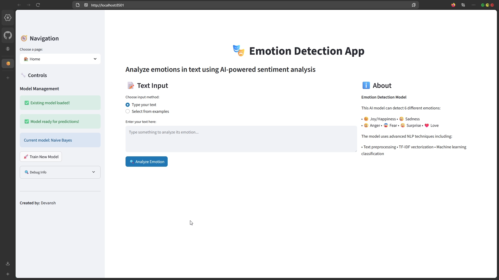
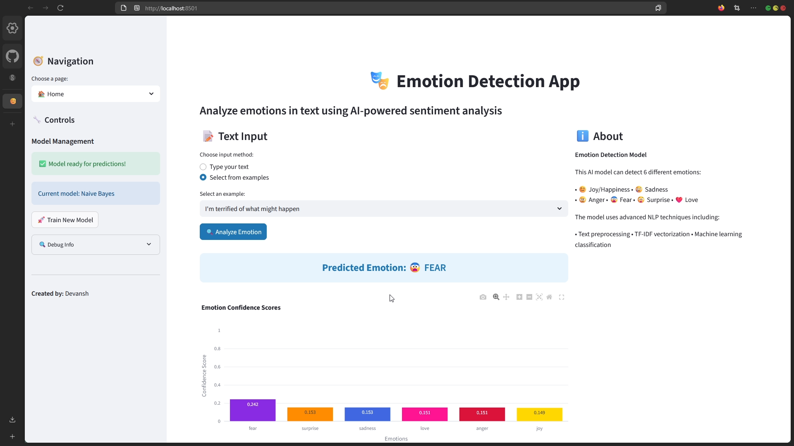
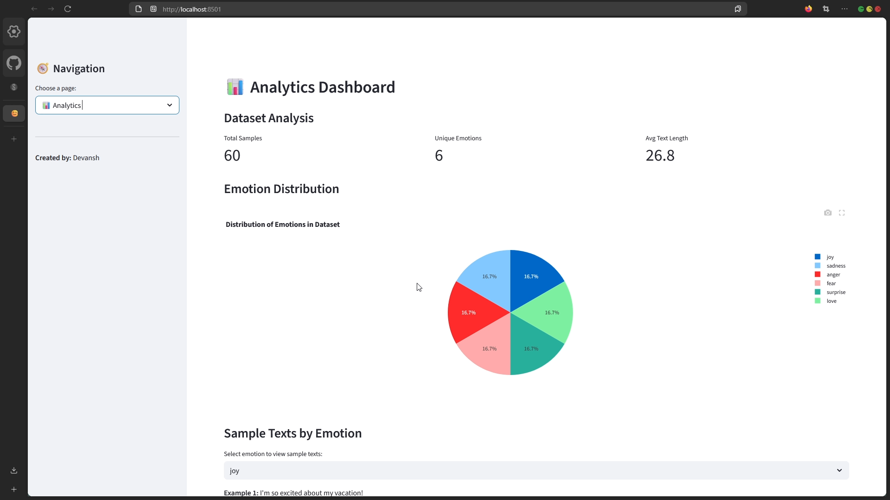

# 🎭 Emotion Detection App

> _"Because who needs therapy when you have Python and a questionable dataset?"_

---

## Welcome to the Emotional Rollercoaster! 🎢

This repository contains my **Emotion Detection App**, built as part of my ML Internship (and, let's be honest, as part of my ongoing struggle with Streamlit, NLTK, and the existential dread of debugging). If you ever wanted to know how a machine thinks you feel, or if you just want to see a grown developer cry over dependency hell, you’re in the right place.

---

## 📸 Screenshots

<div style="display: flex; flex-wrap: wrap; gap: 10px;">
  
  
  
</div>

---

## 🎬 Video Walkthrough

> <b>Watch the magic happen:</b>
>
> [](https://youtu.be/utrLo_hFg20)
>
> <i>Click the thumbnail above to see a full walkthrough of the Emotion Detection App🎭 in action!</i>

---

## 🚀 What Does This Do?

- **Detects emotions** in text using AI-powered sentiment analysis.
- Supports 6 emotions: Joy, Sadness, Anger, Fear, Surprise, and Love (because hate is too mainstream).
- Provides beautiful (and sometimes stubborn) visualizations.
- Lets you train, test, and analyze models in a slick Streamlit web app.
- Comes with a launcher script that tries (and sometimes fails) to open just one browser tab.

---

## 📦 What's Inside?

- `streamlit_app.py` – The main Streamlit app. Where the magic (and most of the bugs) happen.
- `emotion_detector.py` – The ML model. Trained to detect emotions, not developer frustration.
- `visualizations.py` – For all your plotting needs. Because nothing says "data science" like a pie chart.
- `main.py` – The launcher script. It installs stuff, checks stuff, and tries not to open two browsers at once.
- `emotion_model.pkl` – The saved model. If you’re lucky, it’s there. If not, you get to train it yourself!

---

## 🛠️ How To Run (Or: How I Learned to Stop Worrying and Love the Stack Trace)

1. **Clone this repo**  
   ```
   git clone https://github.com/yourusername/emotion-detection-app.git
   cd emotion-detection-app
   ```

2. **Run the launcher**  
   ```
   python main.py
   ```
   - It will check for files, install dependencies, and (hopefully) open the app in your browser.
   - If you see two browser tabs, congrats! You’ve just experienced my pain. (But seriously, it should only open one now.)

3. **Train the model**  
   - Click "Train New Model" in the sidebar.
   - Wait. (And wait. And maybe make coffee.)
   - If you see "Model training may have failed," try again. Or scream into the void.

4. **Analyze emotions**  
   - Type your text or pick an example.
   - Click "Analyze Emotion."
   - Marvel at the results. Or question your life choices.

---

## 😭 What Went Wrong (And How You Can Avoid My Mistakes)

- **Streamlit reruns:**  
  I learned the hard way that `st.rerun()` and `st.experimental_rerun()` are not the same. Check your Streamlit version, or just refresh the page like it’s 2005.

- **Double browser tabs:**  
  Streamlit loves opening browsers. So does Python’s `webbrowser`. Now only one should open, but if you see two, just close one and pretend it’s a feature.

- **Session state madness:**  
  Keeping the model trained across reruns is like herding cats. I used `st.session_state` everywhere. If the app forgets your model, just retrain and move on.

- **NLTK downloads:**  
  If you see errors about missing NLTK data, blame my WiFi. Or run the downloads manually.

- **Dependency hell:**  
  If you get weird errors, check your package versions. Or create a new virtual environment and start over. (I did. Twice.)

---

## 📊 Features

- **Emotion Detection**: Six emotions, one click.
- **Model Training**: Train on a sample dataset (or bring your own).
- **Interactive Visualizations**: Pie charts, bar charts, word clouds, and more.
- **Analytics Dashboard**: Because every internship project needs a dashboard.
- **Debug Info**: For when things inevitably go wrong.

---

## 🤖 Tech Stack

- Python 3.11+
- Streamlit (1.46.0)
- scikit-learn, pandas, numpy
- NLTK, matplotlib, seaborn, plotly, wordcloud, joblib

---

## 🙏 Credits

- **Mentors & Reviewers:** For their patience and for not firing me when the app crashed.
- **Stack Overflow:** For answering questions I was too embarrassed to ask my mentor.
- **Coffee:** For keeping me alive.

---

## 📝 License

MIT. Use it, break it, fix it, send me a meme if you enjoyed it.

---

## 💡 Final Thoughts

If you find a bug, it’s a feature. If you fix a bug, you’re hired.  
If you read this far, you’re probably as emotionally invested as my app.

Happy emotion detecting!  
— Devansh Singh
